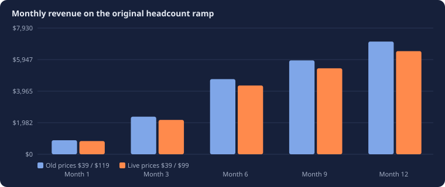
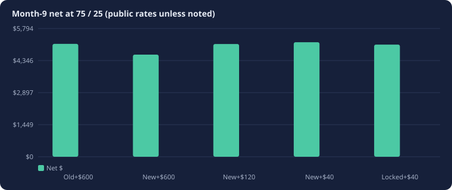
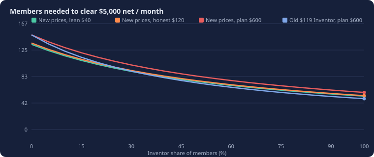
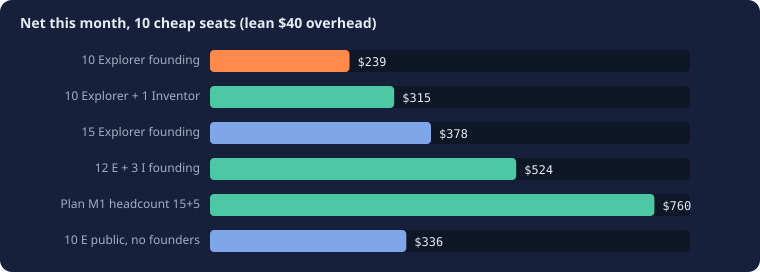
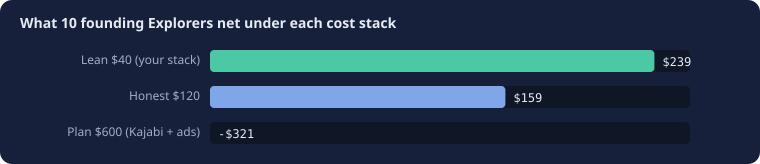
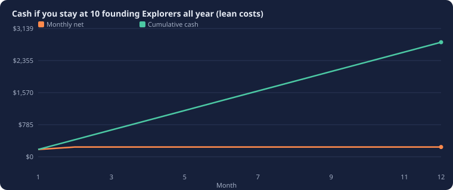
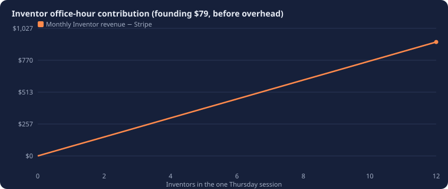

# Robot Logic Lab — go-live math

**Date:** 1 October 2026. **Prices on the site now:** Explorer $39 / $29 founding, Inventor $99 / $79 founding, Inventor semester $299 / $249 founding. Kit $40–80, bought by the family.

This is a pre-launch review of the Fall 2026 rollout plan against those prices, with costs cut to what you actually run (GitHub Pages, Moodle at learn.mgit.io, n8n, Cloudflare). It plays the 10-Explorer and 1-Inventor cases before you charge anyone.

**Open the shareable version:** [rollout.html](rollout.html)

## Verdict

The $5,000/month net goal still works **if overhead stays lean**. It fails if you turn on the plan’s $600 stack (Kajabi + $300 ads) at 10 students.

Inventor tuition dropped $20/month versus the original plan ($119 → $99). On the plan’s month-9 headcount (75 Explorer / 25 Inventor) that is **$500 less revenue**. Lean costs ($40) more than replace Kajabi + ads ($425 of the $600). Net at month 9 on lean public rates: **$5,173**, which clears $5,000. The same headcount on the old $600 stack: **$4,613**, which misses.

**10 founding Explorers and zero Inventors is a viable studio, not a salary.** On lean costs it nets about **$239/month**. Two founding Explorers cover lean costs. Five cover the honest $120 stack (insurance + a VPS share). The original $600 stack needs **22** founding Explorers before it breaks even — that is why ads and Kajabi wait.

**One Inventor is worth running, as a short session.** The Thursday office hour is a fixed cost. One founding Inventor adds **$79** revenue. Keep that session to **25–30 minutes** until four Inventors are in the room. Do not add Zoom, Kajabi, or ads for one person.

Go live on the waitlist and the Sentinel reconstruction now. Charge founding families when DNS works and five Explorers (or three Inventors) are ready to pay. Hold ads at $0.

## What changed versus the written plan

| Item | Original plan | Live offer / stack |
| --- | --- | --- |
| Explorer | $39 · founding $29 | Same |
| Inventor | $119 · founding $89 | $99 · founding $79 |
| Semester | Not in the plan table | Explorer $149 / Inventor $299 |
| Goal | $5,000 net ≈ $5,800 gross ≈ 100 members | Same goal; ~101 members at 25% Inventor on lean costs |
| Overhead | $600 + 3% fees (Kajabi $125, ads $300, tools $175) | Lean $40 or honest $120. Pages, Moodle, n8n, Cloudflare already exist |
| Mix | 3 of 4 Explorer | Same assumption unless Sentinel families pick Inventor |
| Time | 5–8 hours/week, office hour 90 min | Skip office hour at 0 Inventors; 30 min until 4 Inventors |

Industry study check: Inventor semester **$299 for 12 live sessions** sits in the Create & Learn / Coding with Kids band ($284–$420 for twelve). Monthly Inventor $99 is $299 / 3 months. Explorer is the self-paced club and was never that 12-session live product.

## Cost stack — keep it boring

| Line | Plan $600 | Lean $40 (use this at launch) | Honest $120 (once kids are paying) |
| --- | --- | --- | --- |
| Course platform | $100–150 Kajabi / Teachable | $0 Moodle you already run | $25 VPS share |
| Live video | $15 Zoom | $15 Zoom, or $0 Meet | $16 |
| Design | $30 | $0 Canva free | $15 Canva Pro |
| Ads | $300 from month 3 in the plan | $0 until the starter challenge converts | $0 until month 6 |
| Insurance, domain, parts | $100 | $25 domain + demo parts | $40 liability + $25 parts |
| n8n / Cloudflare / Pages | not in the plan | $0 already on | $0 |
| Stripe | 3% of revenue | 2.9% + $0.30 per invoice | same |
| GN2R patch mail | not costed | $6 × paid founders, once | same |

Lean $40 is domain + Zoom + a parts jar. Honest $120 adds insurance and a fair Moodle share. Do not buy a second course platform.

**Break-even Explorers (founding $29):** lean **1.4** → 2 families. Honest **4.3** → 5 families. Plan $600 **21.5** → 22 families.

## Original ramp, rerun at live prices

Plan note: month 1 used founding rates; later rows used full public rates and ignored the founder lock. The last column shows the lock (15 Explorer + 5 Inventor stay at founding rates).

| Milestone | E | I | Old revenue | New revenue | New net lean $40 | New net honest $120 | New net plan $600 | Locked founders revenue |
| --- | --- | --- | --- | --- | --- | --- | --- | --- |
| Month 1 · founding | 15 | 5 | $880 | $830 | $760 | $680 | $200 | $830 |
| Month 3 | 30 | 10 | $2,360 | $2,160 | $2,045 | $1,965 | $1,485 | $1,910 |
| Month 6 | 60 | 20 | $4,720 | $4,320 | $4,131 | $4,051 | $3,571 | $4,070 |
| Month 9 · goal | 75 | 25 | $5,900 | $5,400 | $5,173 | $5,093 | $4,613 | $5,150 |
| Month 12 | 90 | 30 | $7,080 | $6,480 | $6,216 | $6,136 | $5,656 | $6,230 |

Month 9 at public rates, 75 / 25:

- Old prices + $600 overhead: net **$5,099** (the plan’s “goal line”)
- New prices + $600: net **$4,613** — **misses** $5,000 by about $387
- New prices + honest $120: net **$5,093** — **clears**
- New prices + lean $40: net **$5,173** — **clears**
- Founders still locked, lean: revenue $5,290, net **$5,067** — about the goal

To hit $5,000 net at a 25% Inventor mix and public rates you need about **97 members** on lean costs, **98** on honest, **107** on the $600 stack. The old $119 Inventor price needed about **98** on $600. The price cut costs you ~9 members of mix, or about $500/month at month 9. Lean ops give that back.

Year-1 plan “≈ $53k revenue, ≈ $44k you keep” assumed the old blend and $600 overhead. At the new blend (~$54/member vs $59) and lean costs, 60 average members is about $39k revenue and ~$33k net — short of that year-1 story unless you grow faster than 60 average or sell camp. Camp at 40 early-bird non-members is another **$5,960** in June/July.

## Play-through: 10 cheap seats, and one Inventor

| Scenario | People | Revenue | Stripe | Net lean $40 | Net honest $120 | Net plan $600 |
| --- | --- | --- | --- | --- | --- | --- |
| 10 Explorer founding, 0 Inventor | 10 E + 0 I | $290 | $11.41 | $239 | $159 | -$321 |
| 10 Explorer founding + 1 Inventor founding | 10 E + 1 I | $369 | $14.00 | $315 | $235 | -$245 |
| 15 Sentinel, all Explorer founding | 15 E + 0 I | $435 | $17.12 | $378 | $298 | -$182 |
| 12 Explorer + 3 Inventor founding | 12 E + 3 I | $585 | $21.46 | $524 | $444 | -$36 |
| 15 Explorer + 5 Inventor founding (plan M1 headcount) | 15 E + 5 I | $830 | $30.07 | $760 | $680 | $200 |
| 20 founders: 15 Explorer + 5 Inventor, new rates | 15 E + 5 I | $830 | $30.07 | $760 | $680 | $200 |
| 20 founders: 10 Explorer + 10 Inventor | 10 E + 10 I | $1,080 | $37.32 | $1,003 | $923 | $443 |
| Stuck 6 months: 10 Explorer public, 0 Inventor | 10 E + 0 I | $390 | $14.31 | $336 | $256 | -$224 |

### 10 Explorers, 0 Inventors

Revenue **$290** at founding $29. Stripe about $11.41.

- Lean: **$239** in the black. This is coffee-and-parts money, and it pays for the recordings you already wanted to make.
- Honest (insurance on): **$159**.
- Plan $600: **-$321**. That is a loss. Do not run ads or Kajabi here.

Time: skip Thursday office hour. About 5.5 hours/week of recording, community, and marketing ≈ **24 hours/month**. Effective **10/hour** on lean net. That is below a roboticist wage. Treat months 1–3 as **building the library**, not drawing pay. The unit that scales is recorded missions, not live seats.

If this is the whole year:

Twelve months at 10 founding Explorers, lean costs, $60 of patches in month 1: about **$2,803** cash. Fine as a studio. Not the $44k year-1 keep figure.

### 10 Explorers + 1 Inventor

Revenue **$369**. The extra Inventor is **$79** (founding). Lean net **$315**.

The trap: a 90-minute office hour for one kid is **~8–9 hours/month** of live time for $76 after Stripe, about **$9/hour** on the live slice. The Explorer recordings still happen either way.

**Fix:** 25–30 minute Thursday for 1–3 Inventors. Same promise (live roboticist, live feedback), smaller room. At **4 founding Inventors** the one session brings **$316** before fees, still one slot on the calendar.

Do not open a second office hour until **40 Inventors** (the plan’s own guardrail). One Inventor is not a reason to buy Zoom Rooms, a community moderator, or ads.

### 15 Sentinel families (the email list)

If all 15 take founding Explorer: lean net **$378**.  
If 12 Explorer + 3 Inventor: **$524**.  
If they match plan month-1 headcount (15 + 5, which is 20 people): **$760**.

Hold the 15 at the front of the 20 founding spots. Even a full-Explorer take from that list covers honest costs with room.

## Semester and camp cash (lumpier)

Monthly is smoother. Semester is better cash in September and January.

| If these 10 cheap seats pay once | Cash now | Then |
| --- | --- | --- |
| 10 Explorer founding monthly | $290 | Repeats every month until they churn |
| 10 Explorer founding semester ($109) | $1,090 | Silent until the next semester unless they convert to monthly |
| 10 Explorer public semester ($149) | $1,490 | Same shape, public rate |
| 1 Inventor founding semester ($249) | $249 | 12 live sessions already paid |
| 1 Inventor public semester ($299) | $299 | Matches the industry study |
| 10 camp early-bird, not members | $1,490 | Four weeks, then a $1 first-month fall offer |

A semester Inventor at $299 is the study course. Do not discount it on the public page; founding $249 is the only cut, and it closes at 20 families.

Inventors already paying monthly get camp free. At 1 Inventor that gift costs you $149 of list price you were unlikely to collect twice anyway. Leave the perk — it is a reason to pick Inventor.

## Time, wage, and what “realistic” means

| Mode | Hours/month | Example net (lean) | Implied $/hour |
| --- | --- | --- | --- |
| 10 Explorer, no office hour | 24 | $239 | $10 |
| 10 E + 1 I, 90-min office hour | 32 | $315 | $10 |
| 10 E + 1 I, 30-min office hour | 26 | $315 | $12 |
| Plan month 9, 75/25, lean | 32 | $5,173 | $159 |

The plan’s “5–8 hours/week” only becomes a real wage after tens of members, because most of that week is content and marketing with near-zero marginal cost. **Do not hire an editor, buy a filming kit, or run $300 ads** until net is past $2,000/month (the plan’s own unlock table).

## Does it meet the rollout plan?

| Plan checkpoint | Met? |
| --- | --- |
| $5,000 net at ~100 members | Yes on lean/honest costs ($5,173 / $5,093 at 100 people, 25% Inventor). No if you spend $600/month from day one. |
| Month 1 founding 15 E + 5 I = $880 | New founding mix is $830 revenue (-$50 vs plan). Still a fine founding month on lean costs. |
| 3 of 4 Explorer | Still the right mix. Explorer is the scalable product. Inventor is the live room you fill. |
| Industry $299 / 12 live | Yes. That is Inventor semester. Monthly $99 is the same course on a club bill. |
| 5–8 hours/week | Yes if office hour shrinks at n=1 and content is batched. No if you 1:1 every Explorer. |
| Year 1 keep ≈ $44k | Optimistic. Needs the ramp, not 10 stuck Explorers. Camp plus a 100-member second half can still land near it. |
| Churn under 8% | Unchanged and still the number that matters after month 3. |
| Utah ESA fit | $299 is 7.5% of a $4,000 Utah Fits All award. Keep kit as a separate $40–80 materials line. |

## Go-live gates

1. Finish Cloudflare: `@` and `www` CNAME to `wegunterjr.github.io`, DNS only (grey cloud). Do not send the family email until `https://gunterbots.com` loads.
2. Charge **after** five Explorers or three Inventors say yes. The waitlist can collect before that.
3. Overhead cap at launch: **$40**. No Kajabi, no ads, no second Zoom account.
4. Office hour: **off** at 0 Inventors, **30 minutes** at 1–3, **60–90 minutes** at 4+.
5. Mail patches only after a paid founding seat, not with the free Sentinel login.
6. Buy liability insurance when the 6th paying kid joins (honest stack), not before.
7. Ads $0 until the 5-day starter challenge converts waitlist → paid at 5%+. Then $50 tests, not $300.
8. Sibling +$10 and “10 months pay for 12” are still good levers from the plan. They are not on the page yet; add them after the first 20.

## Risks if you ignore the cheap-seat case

- Spending the plan’s $600 on 10 Explorers lights about **$321/month**.
- A 90-minute office hour for one Inventor trains you to hate the live product. Shorten it.
- Founding rates locked for life: 20 founders at 15/5 drag month-9 revenue from $5,400 to $5,290. That is acceptable. Do not extend founding past 20.
- Semester-only Explorers disappear in January. Keep a $1 first-month bridge into year-round, same as the camp→fall offer in the plan.

## Method

Revenue = Explorer count × Explorer price + Inventor count × Inventor price. Stripe = 2.9% + $0.30 per subscription invoice. Net = revenue − Stripe − overhead. Lean overhead $40, honest $120, plan $600. Mix 75/25 matches the written plan. Kit is not tuition. Moodle, n8n, GitHub Pages, and Cloudflare are treated as already paid. Figures are planning math, not a forecast of demand.
